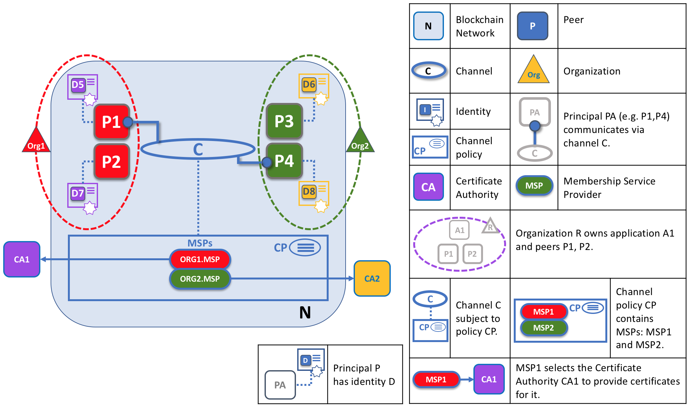

# 节点

区块链网络主要由一组 *Peer 节点*（或者简单地说成*节点*）组成。节点是网络的基本元素，因为它们托管着账本和智能合约。回想一下，账本不可更改地记录了由智能合约（在 Hyperledger Fabric 中就是*链码*，稍后将详细介绍）生成的所有交易。智能合约和账本分别用于封装网络中的共享*进程*和共享*信息*。这些使得节点成为了了解 Fabric 网络的良好开端。

区块链网络的其他元素也很重要：账本和智能合约、排序节点、策略、通道、应用程序、组织、身份和成员，您可以在其各部分中阅读更多相关信息。本节主要讨论节点及其与 Fabric 网络中其他元素的关系。

*区块链网络由节点组成，每个节点都可以保存账本副本和智能合约副本。在本例中，网络 N 由节点 P1、P2 和 P3 组成，它们各自维护各自的分布式账本 L1 的实例。P1、P2 和 P3 使用相同的链码 S1 来访问他们的分布式账本副本。*

节点可以创建、启动、停止、重新配置甚至被删除。它们公开了一组 API，使管理员和应用程序能够与它们提供的服务进行交互。在本节中，我们将更多地了解这些服务。

### 术语

Fabric 实现了称为**链码**的**智能合约**的技术概念，它是访问账本的一段代码，可以用所支持的编程语言编写。在本主题中，我们使用术语**链码**，但是如果您不习惯这个术语，可以将其理解为**智能合约**。它们是一回事！如果您想了解更多关于链码和智能合约的信息，请查看我们关于[智能合约和链码的文档](../smartcontract/smartcontract.html)。

## 账本和链码

让我们更详细地看看节点。我们可以看到，节点托管账本和链码。更准确地说，节点实际上托管着账本**实例**和链码**实例**。注意，这在 Fabric 网络中故意提供了冗余，它避免了单点故障。在本节的后面，我们将更多地了解区块链网络的分布式和去中心特性。

*节点托管账本实例和链码实例。在本例中，P1 托管一个账本 L1 实例和一个链码 S1 实例。在单个节点上可以托管许多账本和链码。*

由于节点是账本和链码的*宿主*，如果应用程序和管理员想访问这些资源，就必须与节点进行交互。这就是为什么节点被认为是构成 Fabric 网络的最基本的构件。当第一次创建节点时，它既没有账本也没有链码。稍后我们将看到如何在节点上创建账本，以及如何安装链码。

### 多账本

节点能够保存多个账本，这很有用，因为它允许灵活的系统设计。最简单的配置是节点管理一个账本，但是当需要时，节点也可以托管两个或多个账本。

*一个节点托管多个账本。节点托管一个或多个账本，每个账本具有零个或多个适用于它们的链码。在这个例子中，我们可以看到节点 P1 托管着账本 L1 和 L2。使用链码 S1 访问账本 L1。另一方面，账本 L2 可以使用链码 S1 和 S2 访问。*

虽然节点完全有可能在不加载任何访问该账本的链码的情况下托管账本实例，但是很少有节点是以这种方式配置的。绝大多数节点将至少安装一个链码，该链码可以查询或更新节点的账本实例。值得一提的是，无论用户是否安装了链码供外部应用程序使用，节点端也有始终存在的特殊**系统链码**。本主题不详细讨论这些。

### 多链码

一个节点拥有的账本数量和能够访问该账本的链码数量之间没有固定的关系。一个节点可能有许多链码和许多账本。

*一个节点托管多个链码的例子。每个账本可以有许多链码来访问它。在这个示例中，我们可以看到节点 P1 托管着 L1 和 L2，其中 L1 由链码 S1 和 S2 访问，L2 由 S1 和 S3 访问。我们可以看到 S1 可以同时访问 L1 和 L2。*

稍后我们将看到为什么 Fabric 中的**通道**概念对于在节点上托管多个账本或多个链码非常重要。

## 应用程序和节点

现在我们将展示应用程序如何与节点交互来访问账本。账本查询交互包括应用程序和节点之间的一个简单的三步对话；账本更新交互稍微复杂一些，需要额外的两个步骤。为了帮助您开始使用 Fabric，我们稍微简化了这些步骤，但是不要担心——你需要理解的最重要的部分是应用程序和节点之间进行查询账本和更新账本的交易类型之间的不同之处。

当应用程序需要访问账本和链码时，它们总是连接到节点。Fabric 软件开发工具包（SDK）使程序员很容易做到这一点，它的 API 使应用程序能够连接到节点，调用链码来生成交易，向网络提交交易，这些交易将被排序并提交到分布式账本，并在此过程完成时接收事件。

通过连接一个节点，应用程序可以执行链码来查询或更新账本。账本查询交易的结果将立即返回，而账本更新涉及应用程序、节点和排序节点之间更复杂的交互。让我们更详细地研究一下。

*节点与排序节点一起，确保每个节点的账本都是最新的。在本例中，应用程序 A 连接到 P1 并调用链码 S1 来查询或更新账本 L1。 P1 调用 S1 生成一个包含查询结果或者账本更新的提案响应。应用程序 A 接收提案响应，对于查询，流程现在已经完成。对于更新，A 会从所有响应构建一个交易，并将其发送到 O1 进行排序。O1 将网络上的交易收集到区块中，并将其分发给所有的节点，包括 P1。P1 在应用到 L1 之前验证交易。更新 L1 之后，P1 生成一个事件，该事件会被 A 接收到，以标识这个过程的结束。*

节点可以立即将查询结果返回给应用程序，因为满足查询所需的所有信息都在节点的本地账本副本中。节点从不与其他节点协商以响应来自应用程序的查询。但是，应用程序可以连接到一个或多个节点来执行查询；例如，在多个节点之间验证结果，或者如果怀疑信息可能过时，则从另一个节点检索最新的结果。在图中，您可以看到账本查询是一个简单的三步过程。

更新交易以与查询交易相同的方式启动，但是有两个额外的步骤。尽管账本更新应用程序也连接到节点以调用链码，但与账本查询应用程序不同，单个节点此时不能执行账本更新，因为其他节点必须首先同意更改，这是称为**共识**的过程。因此，节点向应用程序返回一个**已提案的**更新，该节点将在其他节点事先同意的情况下应用该更新。第一个额外步骤（步骤4）要求应用程序向网络中的所节点发送一组匹配的已提案的更新，作为对各自账本的提交的事务。这是通过应用程序来实现的，它使用一个**排序节点**将交易打包成区块，并将它们分发到网络中所有的节点上，在将它们应用到每个节点的本地账本副本之前，可以对它们进行验证。由于整个排序处理需要一些时间（几秒钟）才能完成，因此将异步通知应用程序，如步骤5所示。

在本节的稍后部分，您将了解关于此排序流程的详细性质的更多信息，要真正详细了解此流程，请参阅[交易流程](../txflow.html)主题。

## 节点和通道

尽管本节讨论的是节点而不是通道，但是有必要花点时间了解节点如何通过*通道*相互交互以及如何与应用程序交互，通道是区块链网络中的一组组件可以*私下*通信和交易的一种机制。

这些组件通常是节点、排序器和应用程序，通过加入一个通道，它们同意协作，共同地共享和管理与该通道关联的相同的账本副本。从概念上讲，您可以将通道看作类似于朋友组（尽管通道的成员当然不需要是朋友！）一个人可能有几组朋友，每组都有他们一起做的活动。这些群体可能是完全独立的（一群工作上的朋友和一群爱好上的朋友相比），或者他们之间可能有交叉。然而，每个组都是自己的实体，具有某种“规则”。

*通道允许一组特定的节点和应用程序在区块链网络中彼此通信。在本例中，应用程序 A 可以使用通道 C 直接与节点 P1和P2通信。（为了简单起见，此图中没有显示排序节点，但是必须在一个正常运行的网络中显示排序节点。）*

我们看到通道的存在方式与节点不同——将通道看作由物理节点集合组成的逻辑结构更合适。*节点为通道的访问和管理提供控制点，理解这一点非常重要。*

## 节点和组织

现在您已经了解了节点及其与账本、链码和通道的关系，您将能够看到多个组织是如何组合在一起形成区块链网络的。

区块链网络由一组组织管理，而不是由一个组织管理。节点对于这种分布式网络的构建至关重要，因为它们属于这些组织，并且是这些组织与网络的连接点。

*在一个网络中有多个组织的多个节点。区块链网络是由不同组织拥有和提供的节点构建的。在这个例子中，我们看到四个组织提供八个节点来组成一个网络。通道 C 连接网络 N 中的五个节点—— P1、P3、P5、P7 和 P8。这些组织拥有的其他节点尚未连接到此通道，但通常至少连接到另一个通道。由特定组织开发的应用程序将连接到他们自己组织的节点以及不同组织的节点。同样，为了简单起见，此图中没有显示排序节点。*

你能够看到当在形成一个区块链网络的时候都发生了什么真的是非常重要的。这个网络是由多个向其提供资源的组织组成和管理的。节点是我们在本主题中讨论的资源，但是组织提供的资源不仅仅是节点。这里有一个原则在起作用——如果组织不为这个网络贡献他们的资源，网络实际上是不存在的。此外，网络随着这些协作组织提供的资源的增加和减少而增长和收缩。

您可以看到（除了排序服务之外）没有集中的资源——在[上面](#Peer8)的示例中，如果组织没有提供它们的节点，网络 **N** 将不存在。这反映了一个事实，即除非各组织提供构成网络的资源，否则网络在任何意义上都不存在。此外，网络并不依赖于任何一个单独的组织——只要有一个组织存在，它就会继续存在，不管其他的组织可能会来或者走。这就是网络去中心化的核心。

就像[上边](#Peer8)的例子，在不同的组织中的应用程序可能相同也可能不同。这是因为一个组织完全取决于它的应用程序如何处理其节点的账本副本。这意味着应用程序和表示逻辑可能会因组织而异，即使它们各自的节点保存着完全相同的账本数据。

应用程序可以连接到其组织中的节点，也可以连接到另一个组织中的节点，这取决于所需的账本交互的性质。对于账本查询交互，应用程序通常连接到它们自己组织的节点。对于账本更新交互，我们将在后面看到为什么应用程序需要连接到代表*每个*组织的节点，这些组织需要背书账本更新。

## 节点和身份

既然您已经了解了来自不同组织的节点如何聚集在一起形成一个区块链网络，那么有必要花一些时间了解节点是如何被其管理员分配到组织中的。

节点会被分配一个身份，这是通过特定证书授权中心颁发给他们的数字证书来实现的。在本指南的其他部分，您可以阅读更多关于 X.509 数字证书如何工作的信息，但是就目前而言，可以将数字证书看作是一个 ID 卡，它提供了关于节点的大量可验证信息。*网络中的每个节点都由所属组织的管理员分配一个数字证书。*

*当节点连接到通道时，其数字证书通过通道 MSP 标识其所属组织。在这个例子中，P1 和 P2 的身份由 CA1 给出。通道 C 根据其通道配置中的策略确定来自 CA1 的身份应该使用 ORG1.MSP 与 Org1 关联。类似的，P3 和 P4 由 ORG2.MSP 识别为 Org2 的一部分。*

当一个节点使用通道连接到区块链网络时，*通道配置中的策略使用节点的身份来确定其权限*。身份到组织的映射是由一个称为*成员服务提供者*（MSP）的组件提供的——它决定如何将节点分配给特定组织中的特定角色，并相应地获得对区块链资源的适当访问权。此外，节点只能由单个组织拥有，因此与单个 MSP 关联。我们将在本节的稍后部分了解更多关于节点访问控制的内容，本指南的其他部分有一整节关于 MSP 和访问控制策略。但是现在，可以将 MSP 看作是在区块链网络中提供个人身份和特定组织角色之间的链接。

稍微讨论一个额外的话题，节点以及*所有与区块链网络交互的东西都从它们的数字证书和 MSP 获得它们的组织身份*。如果节点、应用程序、最终用户、管理员和排序器想要与区块链网络进行交互，他们必须具有身份和关联的 MSP。*我们为使用身份与区块链网络交互的每个实体提供一个名称——主体（principal）*。在本指南的其他地方，您可以了解更多关于主体和组织的信息，但是现在你已经有足够的知识来继续理解节点了！

最后，请注意，节点的物理位置在哪里不是很重要——它可以驻留在云端，或者是由一个组织所有的一个数据中心中，或者在一个本地机器-——与它关联的身份标识出了它所属的组织。在我们上面的例子中，P3 可以托管在 Org1 的数据中心，但是只要与它相关联的数字证书由 CA2 颁发，那么它就属于 Org2。

## 节点和排序节点

们已经看到节点构成了区块链网络的基础，承载着账本和智能合约，可以通过节点连接的应用程序查询和更新这些合约。然而，应用程序和节点相互交互以确保每个节点的账本保持一致的机制是由称为*排序节点*的特殊节点协调的，现在我们将注意力转向这些节点。

更新交易与查询交易有很大的不同，因为单个节点不能单独更新账本（更新需要网络中其他节点的同意）。节点要求网络中的其他节点在将账本更新应用到节点的本地账本之前批准该更新。这个过程称为*共识*，它比一个简单的查询需要更长的时间来完成。但是，当所有需要批准该交易的节点都这样做时，并且该交易已提交到账本，节点将通知其连接的应用程序账本已更新。在本节中，您将看到更多关于节点和排序节点如何管理共识过程的详细信息。

具体来说，想要更新账本的应用程序涉及到一个三步的过程，它确保区块链网络中的所有节点保持它们的账本彼此一致。在第一个阶段，应用程序与*背书节点*的子集一起工作，每个节点都向应用程序提供对提议的账本更新的背书，但是不将提议的更新应用于它们的账本副本。在第二阶段，这些单独的背书作为交易被收集在一起并打包成区块。在最后一个阶段，这些区块被分发给每个节点，在这些节点上，每笔交易在被应用到各自的账本副本之前会先执行验证。

正如您将看到的，排序节点是这个过程的核心，所以让我们稍微详细一点地研究一下应用程序和节点对于一个分布式的和重复的账本是如何使用排序节点来生成账本更新的。

### 第一阶段：提案

交易工作流的第一阶段涉及应用程序和一组节点之间的交互——它不涉及排序节点。阶段一只涉及一个应用程序，该应用程序要求不同组织的背书节点同意提案调用链码的结果。

要开始第一阶段，应用程序生成一个交易提案，并将其发送给每个所需的节点进行背书。然后，每一个背书节点中都使用交易提案独立地执行链码，生成交易提案响应。它不会将此更新应用于账本，而只是简单地签名并将其返回给应用程序。一旦应用程序收到足够数量的签名提案响应，交易流程的第一阶段就完成了。让我们更详细地研究这个阶段。

*交易提案会被每个节点独立地执行，节点会返回经过背书的提案响应。在本例中，应用程序 A1 生成交易 T1 提案的 P，并将其发送给通道 C 上的节点 P1 和 P2。独立地，P2 使用交易 T1 提案 P 执行 S1，生成交易 T1 响应 R2，该响应包含背书 E2。应用程序 A1 收到交易 T1 的两个已背书的响应，即 E1 和 E2。*

最初，应用程序选择一组节点来生成一组关于账本更新的提案。应用程序选择哪些节点？这取决于*背书策略*（为链码定义），它定义了一组组织，这些组织需要在账本更改被网络接受之前对其进行背书。这就是达成共识的真正含义——在其他节点的账本接受*之前*，每一个重要的组织都必须背书提议的账本变更。

节点通过添加其数字签名，并使用其私钥对整个有效负载签名，来背书提案响应。此背书随后可用于证明该组织的节点生成了特定的响应。在我们的示例中，如果节点 P1 属于组织 Org1，则背书 E1 对应一个数字证明——“在账本 L1 上的交易 T1 的反馈 R1 已经被 Org1 的 peer P1 提供了！”。

第一阶段在当应用程序收集到了足够多有效节点签名的提案的响应时结束。我们注意到，不同的节点能够返回不同的响应，因此对于*同一个交易提案*应用程序可能会接收到不同的交易响应。这可能只是因为这个结果是在不同的时间，不同的节点上以及基于不同状态的账本所产生的，在这种情况下，应用程序可以简单地请求新的提案响应。不太可能但是却非常严重的是，结果的不同可能会是因为链码是*非确定性的*。非确定性是链码和账本的敌人，如果发生这种情况，则表明提案的交易存在严重问题，因为不一致的结果显然不能适用于账本。单个节点不能知道他们的交易结果是非确定性的——在检测到非确定性之前，必须收集交易响应进行比较。（严格地说，这还不够，但是我们将这个讨论推迟到交易部分，在交易部分将详细讨论非确定性。）

在第一阶段的最后，如果应用程序希望丢弃不一致的交易响应，它可以自由地丢弃这些响应，从而有效地提前终止交易工作流。稍后我们将看到，如果应用程序试图使用一组不一致的交易响应来更新账本，它将被拒绝。

### 第二阶段：排序和把交易打包成区块

交易工作流的第二阶段是打包阶段。排序节点是这个过程的关键——它接收包含来自许多应用程序的已背书交易提案响应的交易，并将交易排序到区块中。有关排序和打包阶段的更多细节，请查看关于[排序阶段的概念信息](../orderer/ordering_service.html#phase-two-ordering-and-packaging-transactions-into-blocks)。

### 第三阶段：验证和提交

在阶段二的末尾，我们看到排序节点负责收集提案的交易更新、对它们排序并将它们打包成区块，以便分发给节点，这些简单但重要的过程。

交易工作流的最后一个阶段涉及到从排序节点到 Peer 节点的区块的分发和随后的验证，这些区块可以应用到账本中。具体来说，在每一个节点，一个区块内的每一笔交易都要经过验证，以确保它在应用到账本之前得到所有相关组织的一致认可。失败的交易会被留下来进行审计，但不应用于账本。

*排序节点的第二个角色是将区块分发给 peer 节点。在本例中，排序节点 O1 将区块 B2 分配给节点 P1 和 P2。节点  P1 处理区块 B2，产生了一个会被添加到 P1 的账本 L1 中的 一个新的区块。同时，节点 P2 处理区块 B2，产生了一个会被添加到 P2 的账本 L1 中的一个新的区块。当这个过程结束之后，账本 L1 就会被一致地更新到了节点 P1 和 P2 上，他们也可能会通知所连接的 应用程序关于这笔交易已经被处理过的消息。*

阶段三从排序节点将区块分发给连接到它的所有 peer 节点开始。peer 节点和通道上的排序节点相连接，当生成一个新区块时，连接到排序节点的所有 Peer 节点都将被发送一个新区块的副本。每个 Peer 节点会独立地处理这个区块，但与通道上的其他 Peer 节点的处理方式完全相同。这样，我们就能使账本保持一致。同样值得注意的是，并不是每个 peer 节点都需要连接到一个排序节点——peer 节点可以使用 *gossip* 协议将区块信息发送到其他 Peer 节点，而其他 Peer 节点也可以独立地处理它们。但是让我们把这个话题放在其他的时间来讨论吧！

当接收到一个区块时，节点将按照它在区块中出现的顺序处理每个交易。对于每一笔交易，每个节点都将根据生成该交易的链码的*背书策略*，验证该交易是否已被所需组织背书。例如，一些交易可能只需要一个组织的背书，而另一些交易可能需要多个背书才能被认为是有效的。这个验证过程验证所有相关组织是否生成了相同的结果。还要注意，此验证与阶段一中的背书检查不同，在第一阶段中，应用程序接收来自背书节点的响应，并决定发送提案交易。如果应用程序违反了背书策略，发送了错误的交易，那么在第三阶段的验证过程中，节点仍然可以拒绝该交易。

如果一笔交易被正确地背书，节点将试图将其应用于账本。为此，节点必须执行账本一致性检查，以验证账本的当前状态与生成提案更新时账本的状态是否兼容。这也许并不总是可能的，即使交易已经被完全背书过了。例如，另一个交易可能更新了账本中的相同资产，因此交易更新不再有效，因此不能再应用。通过这种方式，每个节点的账本副本在整个网络中保持一致，因为它们都遵循相同的验证规则。

在节点成功地验证每一笔交易之后，它将更新账本。失败的交易，不会应用于账本，但为了审计的目的保留它们，就像成功的交易一样。这意味着节点中的区块几乎与从排序器接收到的区块完全相同，除了区块中每个交易上的有效或无效指示符。

我们还注意到，阶段三不需要运行链码——这只在阶段一中完成，这很重要。这意味着链码只能在背书节点上使用，而不能在整个区块链网络中使用。这通常是有帮助的，因为它保持背书组织链码逻辑的机密性。这与链码（交易提案响应）的输出相反，输出会和通道中的每个节点共享，无论它们是否要背书该交易。这种背书节点的特殊设计是用来帮助可扩展性的。

最后，每次将一个区块提交到节点的账本时，该节点都会生成一个适当的*事件*。*区块事件*包括完整的区块内容，而区块交易事件只包含摘要信息，例如区块中的每个交易验证有效或无效。链码执行产生的*链码*事件也可以在这个时候发布出去。应用程序可以注册这些事件类型，以便在发生时被通知到。这些通知结束了交易工作流的第三个也是最后一个阶段。

总之，第三阶段看到的是由排序节点生成的区块一致地应用于账本。将事务严格地排序到区块中，使得每个节点可以验证交易更新在整个区块链网络上得到了一致地应用。

### 排序和共识

整个交易工作流流程称为*共识*，因为所有节点都已就交易的顺序和内容达成协议，而这个流程是由排序节点协调的。共识是一个多步骤的过程，只有当流程完成时，应用程序才会收到账本更新的通知——在不同的节点上，更新的时间可能略有不同。

我们将在以后的排序节点主题中更详细地讨论它，但是现在，可以这样理解排序节点，它从连接到节点的应用程序搜集和分发账本更新的提案，验证提案并最终包含到账本上。

就是这样！现在我们已经完成了节点之旅，以及与 Fabric 相关的其他组件。我们已经看到，节点在很多方面都是最基本的元素——它们组成网络、托管链码和账本、处理交易提案和响应，并通过一致的应用交易更新来使账本保持最新。

<!--- Licensed under Creative Commons Attribution 4.0 International License
https://creativecommons.org/licenses/by/4.0/) -->
