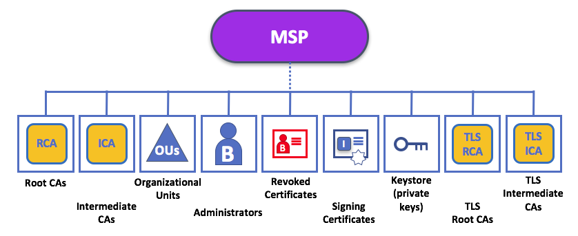

# 成员

如果你已经阅读了[身份](../identity/identity.html)文档，那么你应该已经看到了一个 PKI 是如何能够通过一个信任的链条来提供一个可验证的身份信息的。现在让我们看一下这些身份信息是如何被用来代表这些区块链网络中的可信任的成员的。

这就需要**成员服务**提供者（MSP）发挥作用了，**它标识所信任的根 CA 和中间 CA 定义信任域的成员，例如，一个组织**。通过列出其成员的身份，或者通过标识出哪些 CA 授权为他们的成员发行有效身份，或者通过两者的结合。最后一种方法比较常用。

一个 MSP 的能力远远要超过简单地列出来谁是一个网络的参与者或者是一个通道的成员。MSP 可以识别参与者可能在 MSP 所代表的组织范围内（例如，管理员或作为子组织组的成员）扮演的特定**角色**，并设置在网络和通道上下文中定义**访问权限**的基础（例如，通道管理员、读取者、写入者）。

一个 MSP 的配置文件会被广播到相应的组织成员所参与的所有的通道中（以一种**通道 MSP** 的形式）。除了通道 MSP，Peer 节点、排序节点以及客户端也维护着一个**本地 MSP**，来为在一个通道之外的成员消息进行授权，并且为一个特定的组件定义权限（比如，它有能力在一个节点上来安装链码)。

此外，MSP 还允许标识已被撤销的身份列表（如[身份](../identity/identity.html)文档中所讨论的），但是我们将讨论该过程如何扩展到 MSP。

稍后我们将更多地讨论本地和通道 MSP。现在，让我们看看 MSP 通常做些什么。

### 将 MSP 映射到组织

**组织**是一组被管理的成员。可以是像跨国公司这样的大公司，也可以是像花店这样的小公司。对于组织（简称 **orgs**）来说，最重要的是他们在一个 MSP 下管理他们的成员。注意，这与我们稍后将讨论的 X.509 证书中定义的组织概念不同。

由于组织及其 MSP 之间的排他性关系，所以最好使用组织的名称命名 MSP，您会发现在大多数策略配置中都采用了这种约定。例如，组织 `ORG1` 可能有一个名为 `ORG1-MSP` 之类的 MSP。在某些情况下，组织可能需要多个成员组，例如，通道用于在组织之间执行完全不同的业务功能。在这些情况下，有多个 MSP 并相应地命名是有意义的，例如，`ORG2-MSP-NATIONAL` 和 `ORG2-MSP-GOVERNMENT` ，这反映了 `ORG2` 在`全国`销售通道中与`政府`监管通道中成员的信任根是不同的。

*一个组织有两种不同的 MSP 配置。第一个配置显示了 MSP 和组织之间的典型关系——单个 MSP 定义了组织的成员列表。在第二种配置中，不同的 MSP 用于表示具有国家、国际和政府关联的不同组织组。*

#### 组织的单位以及 MSP

一个组织通常被划分为多个**组织单元**（OU），每个单元都有一组特定的职责。例如，`ORG1` 组织可能同时具有 `ORG1-MANUFACTURING` 和 `ORG1-DISTRIBUTION` OU 来反映这些独立的业务线。当 CA 发出 X.509 证书时，证书中的 `OU` 字段指定身份所属的业务线。

稍后我们将看到，OU 怎样帮助控制组织中被认为是区块链网络成员的部分。例如，只有来自 `ORG1-MANUFACTURING` OU 的身份才能访问通道，而 `ORG1-DISTRIBUTION` 不能。

最后，尽管这是对 OU 的轻微滥用，但有时它们可以被联盟中的不同组织用来区分彼此。在这种情况下，不同的组织使用相同的根 CA 和中间 CA 作为它们的信任链，但是分配 OU 字段来标识每个组织的成员。稍后我们还将看到如何配置 MSP 来实现这一点。

### 本地和通道 MSP

在区块链网络中，MSP 出现在两个位置：通道配置（**通道 MSP**）和参与者本地（**本地 MSP**）。**本地 MSP 是为客户端（用户）和节点（Peer 节点和排序节点）定义的**。节点本地 MSP 为该节点定义权限（例如，节点管理员是谁）。用户的本地 MSP 允许用户端在其交易中作为通道的成员（例如在链码交易中）或作为系统中特定角色的所有者（例如在配置交易中的某组织管理员）对自己进行身份验证。

**每个节点和用户都必须定义一个本地 MSP**，因为它定义了谁拥有该级别的管理或参与权（节点管理员不一定是通道管理员，反之亦然）。

相反，**通道 MSP 在通道级别定义管理和参与权**。每个参与通道的组织都必须为其定义一个 MSP。通道上的 Peer 节点和排序节点将共享通道 MSP，因此能够正确地对通道参与者进行身份验证。这意味着，如果组织希望加入通道，则需要在通道配置中包含一个包含组织成员信任链的 MSP。否则，来自这个组织身份的交易将被拒绝。

本地和通道 MSP 之间的关键区别不在于它们如何工作（它们都将身份转换为角色）而在于它们的**作用域**。

*本地和通道 MSP。每个节点的信任域（例如组织）由节点的本地 MSP（例如 ORG1 或 ORG2）定义。通过将组织的 MSP 添加到通道配置中，可以表示组织加入了通道。例如，此图中的通道由 ORG1 和 ORG2 管理。类似的原则也适用于网络、排序节点和用户，但是为了简单起见，这里没有显示这些原则。*

通过查看区块链管理员安装和实例化智能合约时发生的情况，您可能会发现了解如何使用本地和通道 MSP 很有帮助，如[上图](#msp2img)所示。

管理员 `B` 使用存储在本地 MSP 的 `RCA1` 颁发的身份连接到 Peer 节点。当 `B` 试图在 Peer 节点上安装智能合约时，Peer 节点检查其本地 MSP `ORG1-MSP`，以验证 `B` 的身份确实是 `ORG1` 的成员。验证成功后才会允许安装。随后，`B` 希望在通道上实例化智能合约。因为这是一个通道操作，所以通道上的所有组织都必须同意。因此，Peer 节点必须在成功提交此命令之前检查通道的 MSP。（其他事情也必须发生，但现在先集中精力做上面的事情。）

**本地 MSP 只在它们应用到的节点或用户的文件系统上的定义**。因此，在物理和逻辑上，每个节点或用户只有一个本地 MSP。但是，由于通道 MSP 对通道中的所有节点都可用，所以在逻辑上他们只在通道配置中定义一次。然而，**通道 MSP 也在通道中每个节点的文件系统上实例化，并通过协商一致保持同步**。因此，虽然每个节点的本地文件系统上都有每个通道 MSP 的副本，但从逻辑上讲，通道 MSP 驻留在通道或网络上并由通道或网络维护。

### MSP 层级

通道和本地 MSP 之间的分离反映了组织管理其本地资源（如 Peer 节点或排序节点）和通道资源（如账本、智能合约和联盟）的需求，这些资源在通道或网络级别运行。将这些 MSP 看作是不同**级别**的是有帮助的，处于**较高级别的 MSP 与网络管理相关**，而**处于较低级别的 MSP 处理私有资源管理的身份**。MSP 在每个管理级别都是强制性的——必须为网络、通道、Peer 节点、排序节点和用户定义它们。

*MSP 的级别。Peer 节点和排序节点的 MSP 是本地的，而通道（包括网络配置通道）的 MSP 是对该通道的所有参与者共享的。在这个图中，网络配置通道由 ORG1 管理，但是另一个应用程序通道可以由 ORG1 和 ORG2 管理。Peer 节点是 ORG2 的成员，由 ORG2 管理，而 ORG1 管理图中的排序节点。ORG1 信任来自 RCA1 的身份，而 ORG2 信任来自RCA2 的身份。注意，这些是管理员身份，反映了谁可以管理这些组件。所以当 ORG1 管理网络时，ORG2.MSP 也要在网络定义中。*

* **网络 MSP** ：一个网络的配置文件，通过定义参与组织的 MSP 定义了谁是这个网络中的成员，并且定义了这些成员中的哪些被授权来进行管理相关的任务 （比如，创建一个通道）。

* **通道 MSP**：对于一个通道来说，维护它的成员的 MSP 非常重要。一个通道在一个指定的一系列组织间提供了一个私有的通信方式，这些组织又对这个通道进行管理。在这个通道的 MSP 的上下文中被解释执行的通道策略定义了谁有能力来参与到在这个通道上的某些操作，比如，添加组织或者实例化链码。注意，在管理一个通道和管理网络配置通道（或者任何其他的通道）之间没有必然联系。管理的权利存在于被管理的事务的范围内（除非规则已经被制定，否则查看下边对于 `ROLE` 属性的讨论）。

* **Peer 节点 MSP**：这个本地 MSP 是在每个节点的文件系统上定义的，并且对于每个节点都有一个单独的 MSP 实例。概念上讲，它同通道 MSP 执行着完全一样的操作，但是这些操作限制在仅仅能够被应用到它被定义的那个节点上。在节点上安装一个链码，就是使用节点的本地 MSP 来判定谁被授权进行的一个操作的例子。

* **排序节点 MSP**： 就像 Peer 节点 MSP 一样，一个排序节点的本地 MSP 也是在节点的文件系统上定义的，并且只会应用于这个节点。排序节点也是由一个单独的组织所有，因此具有一个单独的 MSP 来列出它所信任的操作者或者节点。

### MSP 结构

目前为止，你所看到的对于一个 MSP 最为重要的元素就是对于根或者中间 CA 的声明，这些 CA 被用来在对应的组织中建立一个参与者或者节点的成员身份。然而这里还有更多的元素同这两个元素一起来辅助成员相关的功能。

*上面的图显示了本地 MSP 是如何存储在本地文件系统中的。尽管通道 MSP 的物理结构不是完全按照这种方式构建的，但是这样考虑它们仍然是一种有用的方式。*

正如您所看到的，MSP 有九个元素。在目录结构中考虑这些元素最简单，其中 MSP 名称是根文件夹名称，每个子文件夹表示 MSP 配置的一个不同元素。

让我们更详细地描述这些文件夹，看看它们为什么重要。

* **根 CA**：这个文件夹包含了一个这个 MSP 所代表的组织所信任的根证书的自签名 X.509 证书列表。在这个 MSP 文件夹中至少要有一个根 CA X.509 证书。

  这是最重要的一个文件夹，因为它标识了可以被认为是对应组织的成员的所有其他的证书的来源 CA。

* **中间 CA**：这个文件夹包含了由这个组织所信任的中间 CA 对应的 X.509 证书列表。每个证书必须要由这个 MSP 中的一个根 CA 来签发，或者有一个中间 CA 来签发，这个中间 CA 的签发 CA 的链条最终能够导向回一个授信的根 CA。

  一个中间 CA 可能代表了该组织的一个不同的分支（就像对于 `ORG1` 会有 `ORG1-MANUFACTURING` 和 `ORG1-DISTRIBUTION`）， 或者是这个组织自身（比如就像一个商业的 CA 被用来作为组织的身份管理这样的一个情况）。在后边这个情况中，中间 CA 可以被用来代表组织的分支。从[这里](../msp.html)你可能找到关于对于 MSP 配置的最佳实践的更多信息。注意，对于一个工作网络来说，也有可能没有任何的中间 CA，这种情况下，这个文件夹就是空的。

  就像根 CA 文件夹一样，这个文件夹定义了能够被认为是某个组织的成员的证书所来自的 CA。

* **组织单元 （OU）**：这些定义在 `$FABRIC_CFG_PATH/msp/config.yaml` 文件中，并且包含了组织单元的一个列表，他们的成员被认为是由这个 MSP 所代表的组织的一部分。这个在当你想要将组织的成员限定在仅具有某个指定的 OU 的成员（这个身份信息是由 MSP 指定的 CA 签发的）时，它是很有用的。

  指定 OU 是可选的。如果没有列出任何 OU，包含 MSP 的身份（由根 CA 和中间 CA 文件夹标识）都会被认为是组织的成员。

* **管理员**：这个文件夹包含了定义对于该组织来讲具有管理员角色的操作者的所有身份信息的列表。对于标准的 MSP 类型，在这个列表中应该有一个或者多个 X509 证书。

  如果一个操作者具有一个管理者的角色但是它却不能管理某个资源，这是没有意义的！对于一个给定的身份所具有的实际的权利以及对于系统的相关的管理是由管理系统资源的策略所决定的。比如，一个通道策略可能会指明 `ORG1-MANUFACTURING` 管理员有权利来向通道中添加新的组织，然而 `ORG1-DISTRIBUTION` 管理员却没有这个权利。

  尽管一个 X.509 证书拥有 `ROLE` 属性（具体来讲，比如一个操作者是一个 `admin`），这也指的是在它的组织而不是在这个区块链网络上的一个操作者的角色。这个跟 OU 属性的目的是类似的，可以参考在组织中的操作者。

  如果这个通道已经写入了这个允许任何来自于一个组织（(或者某些组织）的管理员来执行某个通道方法（比如初始化链码）的策略的话，这个 `ROLE` 属性才**能够**拥有通道级别的管理权限。这样，这个组织才被赋予了网络级别的决策。

* **撤销证书**：如果一个参与者的身份信息被撤销，有关这个身份信息的标识信息（不是指身份信息本身）会被放置于这个文件夹中。对于基于 X.509 的身份信息，这些标识符是主体密钥标识符 （Subject Key Identifier，SKI） 以及权限访问标识符（Authority Access Identifier，AKI）形式的字符串对，并且会在 X.509 证书被使用的时候被检查，以确保证书没有被收回。

  尽管这个列表在概念上跟 CA 的证书回收列表 （CRL） 是一样的，但它也和从组织中收回成员有关。最后，本地或者通道 MSP 的管理员，能够通过广播这个 CA 更新过的 CRL 的方式快速地从一个组织中撤销一个参与者或者节点，这个 CA 就是颁发这个要撤销的证书的 CA。这个“列表”是可选的。只有在证书要撤销的时候才会用到。

* **节点身份信息**：这个文件夹包含了节点的身份信息，比如，加密材料（包括 KeyStore 的内容）将会允许节点在被发送到该通道和网络的其他参与者的信息中来为自己授权。对于基于 X.509 的身份信息， 这个文件夹包含了一个 **X.509 证书**。这个证书会被 Peer 节点会放置到一笔交易提案的响应中，比如，来表明这个节点已经为这笔交易背书，这个可以在接下来的验证阶段同交易的背书策略一起来进行验证。

  这个文件夹主要在本地 MSP 中，而且必须有一个节点的 X.509 证书。这不适用与通道 MSP 。

* **私钥的 KeyStore**：这个文件夹是为了 Peer 节点或者排序节点（或者在客户端的本地 MSP 中） 的本地 MSP 定义的，并且包含了节点的**签名秘钥**。这个秘钥与**节点身份信息**文件夹里节点身份密钥文件相匹配，并且会用来对数据进行签名，比如作为背书阶段的一部分，会对一个交易提案的响应进行签名。

  这个文件夹对于本地 MSP 是必须的，并且必须要包含一个私钥。很显然，这个文件夹的访问权限，必须限定在于对于这个节点有管理权限的用户。

  一个**通道 MSP** 的配置信息中不会包含这个文件夹，因为通道 MSP 仅仅是为了提供身份信息验证的功能，而不是为了提供签名的能力。

  **TLS 根 CA**：这个文件夹包含了一个自签名的 X.509 证书列表，这个 X.509 证书是由这个组织信任的根 CA 颁发的证书，这是**为了 TLS 通信**。一个 TLS 通信的例子就是，为了接受到新的账本，一个 Peer 节点要连接到个排序节点。

  MSP TLS 信息和网络内部的节点有关联，包括 Peer 节点和排序节点，换句话说，这个并不是指使用这个网络的应用程序和管理功能。

  在这个文件夹中必须至少有一个 TLS 根 CA X.509 证书。

  **TLS 中间 CA**：这个文件夹包含了**在通信时**这个 MSP 所代表的的组织所信任的中间 CA 证书列表。这个文件夹在当商业 CA 用于一个组织的 TLS 证书时特别有用。跟成员的中间 CA 类似，指定中间 TLS CA 是可选的。

  关于 TLS 的更多信息，点击[这里](../enable_tls.html)。

如果你读过这个文档以及我们关于[身份](../identity/identity.html)的文档，你应该对身份和成员在 Hyperledger Fabric 中的作用有了很好的理解。您了解了如何使用 PKI 和 MSP 来识别在区块链网络中协作的参与者。您学习了证书、公钥、私钥和信任根的工作原理，以及 MSP 的物理和逻辑结构。

<!---
Licensed under Creative Commons Attribution 4.0 International License https://creativecommons.org/licenses/by/4.0/
-->