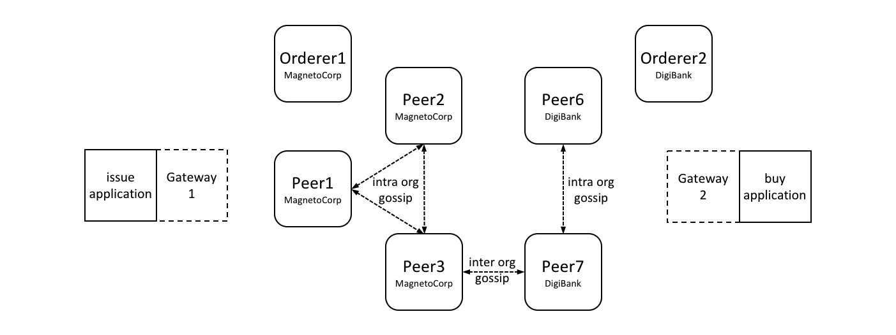

# 网关

**受众**：架构师，应用和智能合约开发者

网关代表应用程序管理与区块链网络的交互，使其能够专注于业务逻辑。应用程序连接到网关，然后
使用该网关的配置管理所有后续交互。

本主题，将包括如下内容：


*  [为什么网关很重要](#scenario)
*  [应用程序如何使用网关](#connect)
*  [如何定义静态网关](#static)
*  [如何为服务发现定义动态网关](#dynamic)
*  [使用多个网关](#multiple-gateways)

## 场景

Hyperledger Fabric 网络通道可以不断变化。peer, orderer 和 CA 组件，由网络中的不同组织提供，
将来去匆匆。造成这种情况的原因包括业务需求增加或减少，以及计划内和计划外中断。网关为应用解除这种负担，使其能够专注于它试图解决的业务问题。

 *MagnetoCorp 和 DigiBank 应用程序（发行和购买）将各自的网络交互委托给其网关。每个网关都了解网络信道拓扑，包括 MagnetoCorp 和 DigiBank 两个组织的多个 peer 和 orderer，使应用程序专注于业务逻辑。peer 可以使用 gossip 协议在组织内部和组织之间相互通信。*

应用程序可以通过两种不同的方式使用网关：

* **静态**：网关配置*完全*定义在[连接配置](./connectionprofile.html)中。应用程序可用的
  所有 peer, orderer 和 CA 在用于配置网关的连接配置文件中静态定义。比如对 peer 来说，这
  包括他们作为背书节点或事件通知节点的角色配置。你可以在连接配置[主题](./connectionprofile.html)
  中了解到更多关于角色的内容。

  SDK 将使用此静态拓扑并结合网关[连接配置](./connectionoptions)来管理交易提交和通知过程。
  连接配置必须包括足够多的网络拓扑来允许网关以应用程序的身份和网络进行交互；包括网络通道，
  组织，orderer, peer 和他们的角色。


* **动态**：网关配置被最小化的定义在连接配置中。通常，指定应用程序组织中的一个或两个 peer，
  然后使用[服务发现](../discovery-overview.html)来发现可用的网络拓扑。这包括 peer, orderer,
  通道，实例化过的智能合约和他们的背书策略。（在生产环境中，网关配置需要至少指定两个可用的 peer 节点。）

  SDK 将使用静态的配置和发现的拓扑信息，结合网关连接选项来管理交易提交和通知过程。
  作为其中的一部分，它还将智能地使用发现的拓扑；比如，它会使用为智能合约发现的背书策略
  来*计算*需要的最少背书节点。

你可能会问静态或动态网关哪一个更好？权衡取决于可预测性和响应性。静态网络将始终以相同的方式运行，
因为它们将网络视为不变。从这个意义上讲，它们是可预测的 - 如果它们可用，它们将始终使用相同的 peer 和 orderer。动态网络在了解网络如何变化时更具响应性 - 它们可以使用新添加的 peer 和 orderer，从而带来额外的弹性和可扩展性，可能会带来一定的可预测性成本。一般情况下，使用动态网络比较好，实际上这是网关的默认模式。

请注意，静态或动态可以使用*相同*的连接配置文件。显然，如果配置文件被静态网关使用，它需要是全面的，
而动态网关使用只需要很少的配置。

这两种类型的网关对应用程序都是透明的；无论是静态网关还是动态网关应用程序设计无序改变。
意思就是一些应用可以使用服务发现，另外一些可以不使用。通常，SDK 使用动态发现意味着更少的定义和
更加的智能；而这是默认的。

## 连接

当应用连接到一个网关，需要提供两个配置项。在随后的 SDK 处理程序中会使用到：

```javascript
  await gateway.connect(connectionProfile, connectionOptions);
```

* **连接配置**：不管是静态网关还是动态网关，`connectionProfile` 是被 SDK 用来做交易处理的网关配置项，它可以使用 YAML 或 JSON 进行配置，尽管在传给网关后会被转换成 JSON 对象。

  ```javascript
  let connectionProfile = yaml.safeLoad(fs.readFileSync('../gateway/paperNet.yaml', 'utf8'));
  ```

  阅读更多关于[连接配置](./connectionprofile.html)的信息，了解如何配置。


* **连接选项**：`connectionOptions` 允许应用程序声明而不是实现所需的交易处理行为。连接
  选项被 SDK 解释以控制与网络组件的交互模式，比如选择哪个身份进行连接，使用哪个节点做事件
  通知。这些选项可在不影响功能的情况下显著地降低应用复杂度。这是可能的，因为 SDK 已经实现
  了许多应用程序所需的低级逻辑; 连接选项控制逻辑流程。

  阅读可用的[连接选项](./connectionoptions.html)列表以及何时使用它们。

## 静态网关

静态网关定义了一个固定的网络视图。在 MagnetoCorp [场景](#scenario)中，网关可以识别来自
MagnetoCorp 的单个 peer，来自 DigiBank 的单个peer 以及 MagentoCorp 的 orderer。或者，
网关可以定义来自 MagnetCorp 和 DigiBank 的*所有* peer 和 orderer。在两个案例中，网关
必须定义充分的网络视图来获取和分发商业票据的交易背书。

应用可以通过在 `gateway.connect()` API 上明确指定连接选项 `discovery: { enabled:false }` 来使用静态网关。或者，在环境变量中设置 `FABRIC_SDK_DISCOVERY=false`，将始终覆盖应用程序的选择。

检查被 MagnetoCorp 发行票据应用使用的[连接选项](https://github.com/hyperledger/fabric-samples/blob/master/commercial-paper/organization/magnetocorp/gateway/networkConnection.yaml)。了解一下所有的 peer，orderer 和 CA 是如何配置的，包括他们的角色。

值得注意的是，静态网关代表*这一刻*的网络视图。随着网络的变化，在网关文件中反映变更可能很重要。
当重新加载网关配置文件时，应用程序将会自动生效这些变更。

## 动态网关

动态网关为网络定义一个小的固定*起点*。在 MagnetoCorp [场景](#scenario)中，动态网关可能只识别来自 MagnetoCorp 的单个 peer; 其他一切都将被发现！（为了提供弹性，最好定义两个这样的引导节点。）

如果应用程序选择了[服务发现](../discovery-overview.html)，则网关文件中定义的拓扑将使用此进程生成的拓扑进行扩充。服务发现从网关定义开始，使用 [gossip 协议](../gossip.html)查找MagnetoCorp 组织内的所有连接的 peer 和 orderer。如果已为某个通道定义了[锚节点](../glossary.html#anchor-peer)，则服务发现将使用跨组织的 goosip 协议来发现已连接组织的组件。此过程还将发现安装在 peer 上的智能合约及其在通道级别定义的背书策略。与静态网关一样，发现的网络必须足以获取和分发商业票据交易背书。

动态网关时 Fabric 应用的默认设置。可在 `gateway.connect()` API 上明确的指定连接选项配置
`discovery: { enabled:true }`。或者，设置环境变量 `FABRIC_SDK_DISCOVERY=true`，将会
覆盖应用程序的选择。

动态网络代表了一个与时俱进的网络视图。随着网络的改变，服务发现将会确保网络视图精确反映
应用程序可见的拓扑。应用程序将会自动生效这些变更；甚至不需要重载网关配置文件。

## 多网关

最后，应用程序可以直接为相同或不同的网络定义多个网关。此外，应用程序可以静态和动态地使用命名网关。

拥有多个网关可能会有所帮助。 原因如下：

* 代表不同用户处理请求。

* 同时连接不同的网络。

* 通过同时将其行为与现有配置进行比较来测试网络配置。

<!--- Licensed under Creative Commons Attribution 4.0 International License
https://creativecommons.org/licenses/by/4.0/ -->